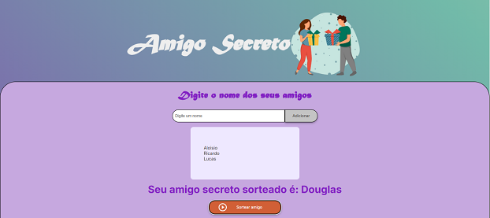

# Desafio do Amigo Secreto

 

  

## Indice

- <a href="#objetivo">Objetivos do Projeto</a>
- <a href="#funcionalidades">Funcionalidades do Projeto</a>
- <a href="#language-e-tools-️">Language e tools</a>
- <a href="#layout">Layout</a>

## Objetivos do Projeto 📜

O objetivo principal deste desafio é inserir nomes em uma lista que é exebida logo abaixo, atualizando automaticamente. Ao sortear um nome aleatório a lista é atualizada retirando o nome sorteado e exibindo a mensagem indicando que o nome é seu amigo secreto.

## Funcionalidades do Projeto 🎫

- [x] Insere nomes de amigos
- [x] Atualisa a lista de amigos
- [x] Sorteia um amigo
- [x] Retira da lista o nome do amigo sorteado
- [x] Exibe qual nome foi sorteado

## Layout ⚡

### Language e tools 🖥️

<code></code>
<code></code>
<code></code>
<code></code>

## Reach me 📫

   

